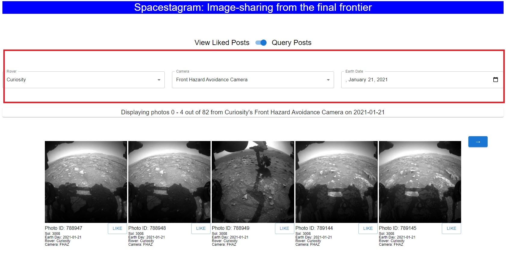
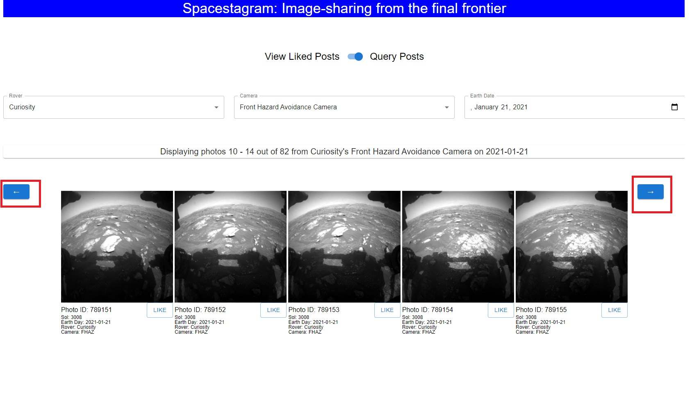
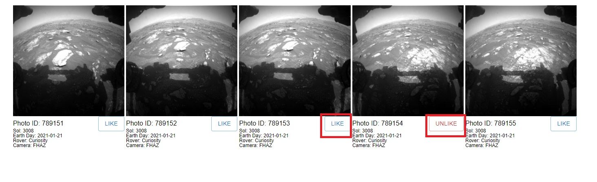
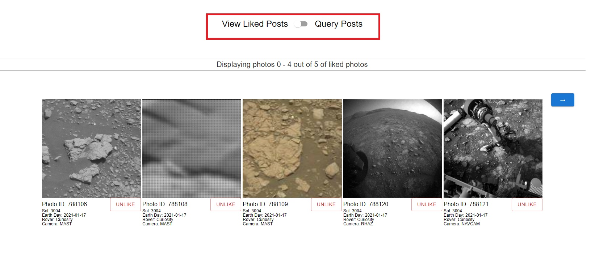

# Shopify Frontend Developer Intern Summer 2022

[Link to application](https://colischeng.github.io/Shopify-Frontend-Developer-Intern-Summer-2022)

[Link to technical requirements](https://docs.google.com/document/d/1ICu8X_DHYePf6wIA4cJuTM-fLy0atd5eNjKCfkXC3hw/edit#heading=h.cny9umcsnqqn)

<br />

A web application using ReactJS, React-Redux, and Material-UI that displays Mars Rover Photos from the NASA API. The application supports "liking" and "unliking" photos with the following additional functionalities:

<br />

- Viewing only previously "liked" photos by toggling
- A Rover, Camera, and Earth Date UI that allows users to pick and browse photos starting from a specific set of parameters

<br/>

**Note that indexes of the photos are 0-based.**

<br />

## Instructions

### Running Locally

While a live demo is deployed on Github Pages in the link listed above, you can also run the application locally. The only prerequisite is having Node installed. Assuming you have Node installed, clone the repository. Copy the following command into your terminal.

```
git clone https://github.com/colischeng/Shopify-Frontend-Developer-Intern-Summer-2022.git
```

Once the repository is cloned, simply start the program by running the following scripts.

```
npm install
npm start
```

<br/>

### Searching Photos

You can search for photos using any combination of parameters of "Rover", "Camera", and "Earth Date".

For example, the following search would let you browse all 83 photos (0 based!) from Curiosity's Front Hazard Avoidance Camera on January 21, 2021.



Any changes to our search parameters will automatically update the UI.

<br/>

### Toggling between photos

At any given time, you will be able to see at most 5 photos on your screen. You can click the left and right buttons to browse more photos.



<br/>

### Liking and Unliking

Under each post, you have the ability to "Like" and "Unlike" the photo.



Any unliked photos will display a "Like" button, whereas any liked photos will display an "Unlike" button.

<br/>

### Looking at Only Liked Posts

If you want to browse through your previously liked photos, simply switch views by clicking on the toggle at the top of the page.



The liked photos tab will give you the same ability to unlike photos. Also, any newly unliked photos will be automatically updated in the UI.
